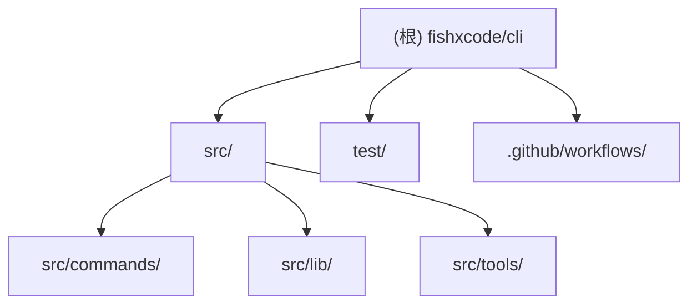

# FishXCode CLI — 根级 AI 上下文

## 项目愿景

FishXCode CLI（命令行工具名：`fishx` / `fishxcode`）是一个帮助开发者一键将 AI 编码工具接入 FishXCode API 代理服务的命令行工具。通过统一的适配器机制，用户无需手动修改各工具配置文件，即可完成 claude-code、aider、codex、continue.dev、opencode、openclaw 等主流 AI 编码工具的 API 来源切换。

- 官网：https://fishxcode.com
- 仓库：https://github.com/fishxcode/fishxcode-cli
- 版本：0.1.0
- 许可：MIT

---

## 架构总览

- **运行时**：Bun >= 1.1.0，Node.js >= 18（兼容）
- **语言**：TypeScript（ES2022，模块系统：NodeNext）
- **打包**：`bun build` 单文件输出到 `dist/index.js`，注册为全局二进制 `fishx` / `fishxcode`
- **依赖**：`commander`（CLI 框架）、`picocolors`（终端色彩），无其他运行时依赖
- **配置存储**：用户主目录下的 `~/.fishxcode/config.json`
- **适配器模式**：每个 AI 工具对应一个 `ToolAdapter` 实现，统一接口为 `checkInstalled / isConfigured / configure / reset`

```text
用户输入 fishx <command>
    └─> src/index.ts (Commander 注册入口)
          ├─> src/commands/      (6 个命令处理器)
          │     ├─> src/lib/     (config、constants、prompt、tools 共享库)
          │     └─> src/tools/   (6 个工具适配器 + 类型 + 工具函数)
          └─> 写入各工具在用户 HOME 下的配置文件
```

---

## 模块结构图



---

## 模块索引

| 模块路径 | 职责简述 |
| --- | --- |
| [src/commands/](./src/commands/CLAUDE.md) | CLI 命令实现：login/logout/whoami/setup/doctor/tools/reset/balance |
| [src/lib/](./src/lib/CLAUDE.md) | 共享库：配置读写、常量定义、交互式提示、工具信息列表 |
| [src/tools/](./src/tools/CLAUDE.md) | 6 个 AI 工具适配器 + ToolAdapter 类型定义 + 工具函数 |
| [test/](./test/CLAUDE.md) | 单元测试：config.maskKey、tools.parseJsonc |

---

## 运行与开发

```bash
# 安装依赖
bun install

# 本地开发运行（无需构建）
bun run dev                   # 等价于 bun run src/index.ts

# 类型检查
bun run typecheck

# 单元测试
bun test

# 构建生产包
bun run build                 # 输出到 dist/index.js

# 发布前全量检查（typecheck + test + build）
bun run check

# 全局安装后使用
fishx login
fishx setup
fishx doctor
fishx tools
fishx balance
fishx reset
fishx logout
fishx whoami
```

### 环境变量

| 变量名 | 说明 |
| --- | --- |
| `FISHXCODE_API_KEY` | 可替代 login 持久化配置的 API Key |

---

## 测试策略

- 测试框架：**Bun 内置 test**（`bun:test`），无外部测试库
- 测试文件位于 `test/` 目录，文件名后缀 `*.test.ts`
- 当前测试覆盖：
  - `test/config.test.ts`：`maskKey` 函数（短 key / 正常 key）
  - `test/utils.test.ts`：`parseJsonc` 函数（行注释、块注释）
- 运行：`bun test`
- CI 中自动执行（见 `.github/workflows/ci.yml`）

**缺口**：命令层、适配器层暂无测试覆盖，`configure` / `reset` 等核心流程依赖文件系统，建议后续补充集成测试。

---

## 编码规范

- 严格 TypeScript（`"strict": true`），`noEmit` 模式下通过 `tsc` 类型检查
- 模块系统：ESM（`"type": "module"`），导入时显式加 `.js` 后缀
- 无 Lint 工具配置（ESLint/Biome），依赖 TypeScript 严格模式兜底
- 每个工具适配器独立一个文件，统一实现 `ToolAdapter` 接口
- 配置块用标记注释（如 `# fishxcode-cli managed`）隔离，支持幂等写入与清理

---

## AI 使用指引

- **入口文件**：`src/index.ts`（Commander 注册所有命令）
- **新增命令**：在 `src/commands/` 添加文件，在 `src/index.ts` 注册
- **新增工具适配器**：实现 `ToolAdapter` 接口（见 `src/tools/types.ts`），在 `src/tools/index.ts` 注册，在 `src/lib/tools.ts` 的 `SUPPORTED_TOOLS` 中添加条目
- **配置路径约定**：适配器写入 `~/<tool_config_dir>/`，不写入项目目录
- **幂等性**：`configure` 须保证重复执行结果一致，`reset` 须仅清除本工具写入的字段
- **不要修改**：`dist/` 目录（构建产物，gitignore 已忽略）

---

## 变更记录 (Changelog)

| 时间 | 类型 | 内容 |
| --- | --- | --- |
| 2026-03-08 12:31:46 | 初始化 | 首次生成 AI 上下文文档（根级 + 4 个模块级 CLAUDE.md，.claude/index.json） |
